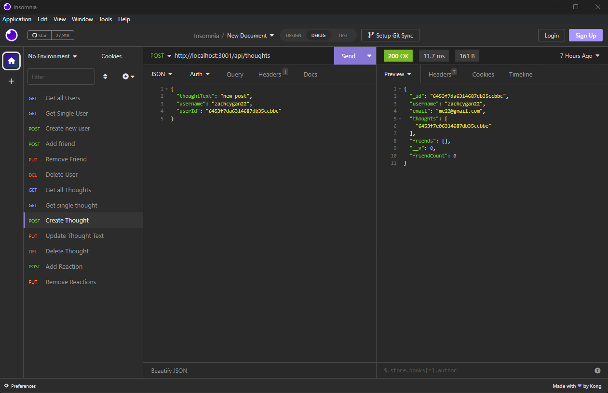
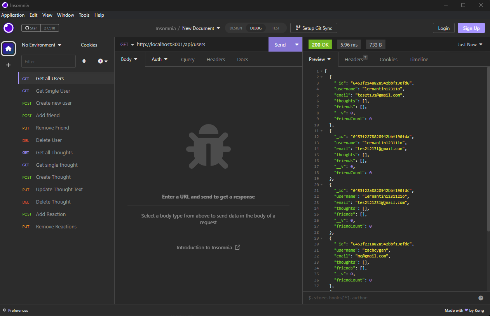
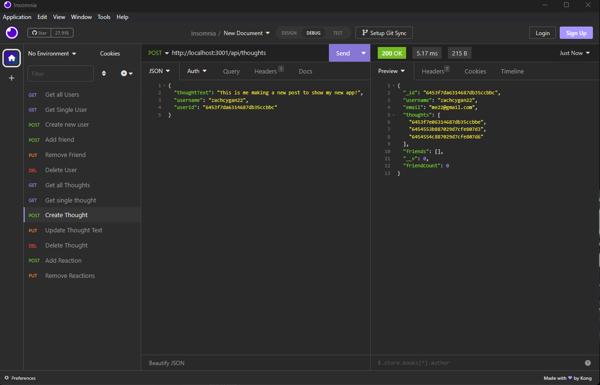
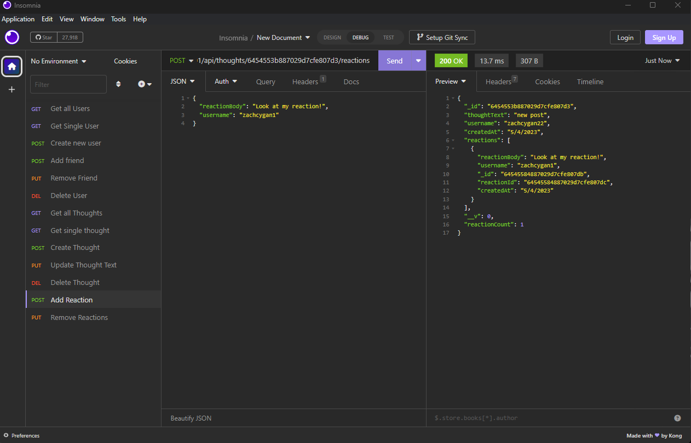

# Social-Media Backend

## Description

My motivation for this project was to make a database using mongoDB. I used virtuals to show the number of friends any user has, instead of including it directly in the database. 

## Installation

The webpage is available at https://github.com/zachcygan/social-media-backend. Be sure to install any dependencies by typing in "npm i" in the console. This will install express and mongoose. 

## Instructions

To begin installing the program, to be sure to type "npm i" inside the terminal to install any dependencies. To run the program type, "npm index.js" inside the terminal. This will allow you to use insomnia, or any other API testing application, to hit the endpoints of the app. This gives you the ability to complete CRUD operations on the application. 

## Video Demonstration

## Screenshots

